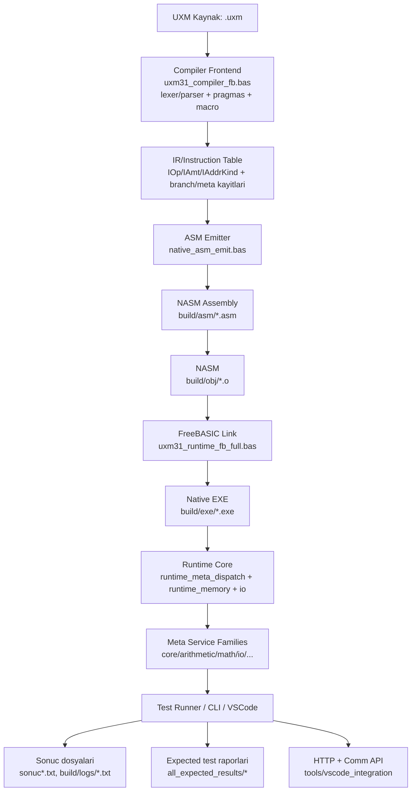

# UXM Compiler Mimarisi (V33)

Bu dokuman UXM derleme/yurutme hattini grafik olarak gosterir ve katman ciktilarini ozetler.

## Grafik

## Katman Ciktilari

- Kaynak girisi: `uxm/tests/**/*.uxm`
- Frontend parse sonucu: instruction tablolari (bellekte)
- Kod uretimi: `build/asm/<program>.asm`
- Obje dosyasi: `build/obj/<program>.o`
- Linklenmis binary: `build/exe/<program>.exe`
- Derleyici binary: `build/exe/uxm_native.exe`
- Test/ci loglari: `build/logs/*.txt`, `sonuc*.txt`
- Beklenen-test raporlari: `all_expected_results/<run_id>/`

## Kritik Dosyalar

- Compiler giris noktasi: `uxm/core/compiler/native/uxm31_compiler_fb.bas`
- CLI + pragma + memory model: `uxm/core/compiler/native/native_cli.bas`
- Lexer/parser: `uxm/core/compiler/native/native_lexer_parser.bas`
- Adresleme cozumleyici: `uxm/core/compiler/native/native_addressing.bas`
- ASM emit: `uxm/core/compiler/native/native_asm_emit.bas`
- Runtime dispatch: `uxm/core/runtime/runtime_meta_dispatch.bas`
- Servis registry: `config/uxm/service_registry_merged.csv`
